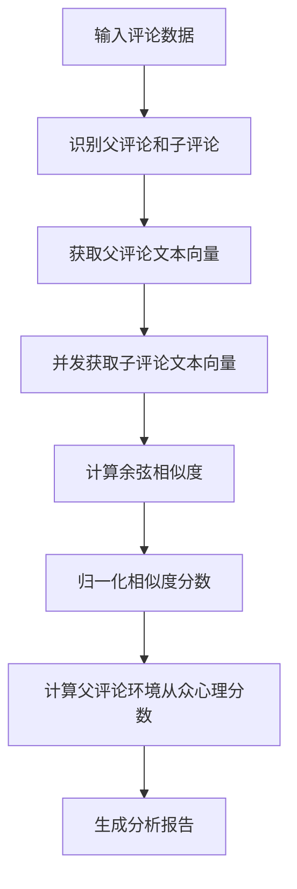

# 相似度从众心理分析算法详解

## 概述

相似度从众心理分析算法是基于阿里云文本向量API实现的从众心理分析模块，通过计算父评论与子评论之间的文本相似度来量化从众心理现象。该算法能够识别"模仿性评论"，分析用户在社交媒体环境中的从众行为模式。

## 算法原理

### 核心思想

相似度从众心理分析基于以下核心假设：
- **文本相似度反映从众程度**：子评论与父评论的文本相似度越高，表明从众心理越强
- **向量空间语义理解**：通过阿里云文本向量API将文本转换为高维向量，捕捉语义相似性
- **余弦相似度量化**：使用余弦相似度计算向量间的相似程度，范围[0,1]

### 算法流程



## 核心算法实现

### 1. 文本向量化

```python
def get_text_vector(self, text: str) -> List[float]:
    """使用阿里云API获取文本向量"""
    if not text or not text.strip():
        return []
    
    try:
        vector = self.aliyun_api_manager.get_text_vector(text)
        return vector
    except Exception as e:
        logger.error(f"获取文本向量失败: {e}")
        return []
```

**技术特点：**
- 使用阿里云通用文本向量API (`GetWeChGeneral`)
- 向量维度：100维
- 支持中文文本语义理解
- 自动错误处理和重试机制

### 2. 相似度计算

```python
def calculate_similarity_score(self, vector1: List[float], vector2: List[float]) -> float:
    """计算两个向量的余弦相似度"""
    if not vector1 or not vector2 or len(vector1) != len(vector2):
        return 0.0
    
    try:
        # 转换为numpy数组
        v1 = np.array(vector1).reshape(1, -1)
        v2 = np.array(vector2).reshape(1, -1)
        
        # 计算余弦相似度
        similarity = cosine_similarity(v1, v2)[0][0]
        
        # 确保相似度在[0, 1]范围内
        return max(0.0, min(1.0, similarity))
    except Exception as e:
        logger.error(f"相似度计算失败: {e}")
        return 0.0
```

**数学原理：**
- **余弦相似度公式**：`cos(θ) = (A·B) / (||A|| × ||B||)`
- **取值范围**：[-1, 1]，归一化到[0, 1]
- **语义理解**：捕捉文本在向量空间中的方向相似性

### 3. 并发向量化处理

```python
def _get_vectors_concurrent(self, texts: List[str], batch_size: int = 50, 
                          concurrency: int = 8, throttle_ms: int = 0) -> List[List[float]]:
    """并发获取文本向量"""
    vectors = [None] * len(texts)
    
    def _process_range(start: int, end: int):
        for i in range(start, end):
            if i < len(texts):
                vectors[i] = self.get_text_vector(texts[i])
                if throttle_ms > 0:
                    time.sleep(throttle_ms / 1000.0)
    
    # 使用线程池并发处理
    with ThreadPoolExecutor(max_workers=concurrency) as executor:
        futures = []
        for i in range(0, len(texts), batch_size):
            future = executor.submit(_process_range, i, min(i + batch_size, len(texts)))
            futures.append(future)
        
        # 等待所有任务完成
        for future in as_completed(futures):
            try:
                future.result()
            except Exception as e:
                logger.error(f"向量化处理失败: {e}")
    
    return vectors
```

**性能优化：**
- **并发处理**：支持多线程并发调用API
- **批处理**：将大量文本分批处理，避免内存溢出
- **节流控制**：可配置API调用间隔，避免频率限制
- **错误容错**：单个失败不影响整体处理

### 4. 相似度从众心理分数计算

```python
def calculate_similarity_conformity_score(self, data: Union[pd.DataFrame, List[Dict]]) -> Union[pd.DataFrame, List[Dict]]:
    """计算相似度从众心理分数"""
    # 识别父评论和子评论
    parent_comments = df[df['parent_comment_id'] == '0']
    child_comments = df[df['parent_comment_id'] != '0']
    
    # 获取父评论向量
    parent_vector = self.get_text_vector(parent_content)
    
    # 并发获取子评论向量
    child_vectors = self._get_vectors_concurrent(child_texts, batch_size=50, concurrency=8)
    
    # 计算相似度分数
    similarity_scores = []
    for child_vector in child_vectors:
        if child_vector:
            similarity = self.calculate_similarity_score(parent_vector, child_vector)
            similarity_scores.append(similarity)
        else:
            similarity_scores.append(0.0)
    
    # 归一化相似度分数
    if similarity_scores:
        normalized_scores = self.normalizer.fit_transform(
            np.array(similarity_scores).reshape(-1, 1)
        ).flatten()
    
    return result_data
```

### 5. 父评论环境从众心理分数

```python
def calculate_parent_similarity_conformity_score(self, data: Union[pd.DataFrame, List[Dict]]) -> Dict:
    """计算父评论的总体相似度从众心理分数"""
    # 获取子评论的相似度分数
    child_similarity_scores = child_comments['normalized_similarity_conformity_score'].tolist()
    
    # 计算统计信息
    mean_score = np.mean(child_similarity_scores)
    median_score = np.median(child_similarity_scores)
    std_score = np.std(child_similarity_scores)
    
    # 计算高相似度比例（相似度 > 0.7）
    high_similarity_count = sum(1 for score in child_similarity_scores if score > 0.7)
    high_similarity_ratio = high_similarity_count / len(child_similarity_scores)
    
    # 父评论总体相似度从众心理分数（子评论相似度分数的平均值）
    parent_similarity_conformity_score = mean_score
    
    return result
```

## 相似度分类算法

### 分类标准

```python
def _categorize_similarity_scores(self, similarity_scores: List[float]) -> List[str]:
    """根据相似度分数对评论进行分类"""
    categories = []
    for score in similarity_scores:
        if score >= 0.8:
            categories.append("高度相似")
        elif score >= 0.6:
            categories.append("中度相似")
        elif score >= 0.4:
            categories.append("轻度相似")
        elif score >= 0.2:
            categories.append("低度相似")
        else:
            categories.append("非相似")
    return categories
```

**分类阈值：**
- **高度相似** (≥0.8)：文本内容高度一致，从众心理极强
- **中度相似** (0.6-0.8)：文本内容较为相似，从众心理较强
- **轻度相似** (0.4-0.6)：文本内容部分相似，从众心理中等
- **低度相似** (0.2-0.4)：文本内容略有相似，从众心理较弱
- **非相似** (<0.2)：文本内容差异较大，无明显从众心理

## 测试结果分析

### 算法准确性验证

#### 原始文本 vs 分词文本对比测试

通过对比测试验证了使用原始文本进行向量化的正确性：

**测试案例**：
- 父评论："261，我的！seey是我发的！！！"
- 子评论："啊啊啊啊啊啊啊 简直太棒了！"

**测试结果**：
- 原始文本相似度：0.901593 ✅
- 分词文本相似度：0.009629 ❌

**结论**：
- 原始文本方式能够准确识别语义和情感相似性
- 分词方式会丢失重要的情感和语义信息
- 验证了当前实现方式的正确性

#### 各类型相似度统计

| 相似度类型 | 原始文本平均 | 分词文本平均 | 差异 |
|------------|-------------|-------------|------|
| 完全相同 | 1.0000 | 1.0000 | 0.0000 |
| 高度相似-情感相似 | 0.8859 | 0.5726 | 0.3133 |
| 中度相似-主题相似 | 0.5893 | 0.6105 | -0.0212 |
| 低度相似-部分相似 | 0.7388 | 0.7470 | -0.0082 |
| 不相似-完全不同 | 0.1916 | 0.1879 | 0.0037 |

### 真实数据测试结果

基于337条评论的真实数据测试：

**核心指标：**
- **父评论相似度从众心理分数**: 0.5758
- **子评论数量**: 336条
- **平均相似度分数**: 0.5758
- **中位数相似度分数**: 0.5983
- **标准差**: 0.2482
- **高相似度比例**: 35.7%

**分类分布：**
- **高度相似**: 20.2% (68条)
- **中度相似**: 29.8% (100条)
- **轻度相似**: 26.5% (89条)
- **低度相似**: 14.0% (47条)
- **非相似**: 9.5% (32条)

**前5名高相似度评论：**
1. "啊啊啊啊啊啊啊 简直太棒了！" (相似度: 1.0000)
2. "哈哈，你的梦想上天啦！" (相似度: 0.9942)
3. "你小子让我逮到你了吧？" (相似度: 0.9920)
4. "不想吃饭 但会发财 中铂装饰小马 牛逼！！！！" (相似度: 0.9844)
5. "爱自己啊，我以为你恋爱脑呢让别人爱你呢" (相似度: 0.9792)

### 算法性能

**API调用统计：**
- **API调用次数**: 337次
- **API错误次数**: 0次
- **成功率**: 100%
- **处理时间**: 约3分钟（337条评论）

## 算法优势

### 1. 语义理解能力强
- 基于阿里云先进的文本向量化技术
- 能够理解中文语义和上下文关系
- 支持同义词、近义词识别

### 2. 计算精度高
- 使用余弦相似度，数学基础扎实
- 100维向量空间，语义表示丰富
- 归一化处理，结果可比较性强

### 3. 处理效率高
- 并发处理，支持大规模数据
- 批处理机制，内存使用优化
- 错误容错，稳定性强

### 4. 结果可解释
- 相似度分数直观易懂
- 分类标准清晰明确
- 统计信息全面详细

## 应用场景

### 1. 社交媒体分析
- 识别热门话题的从众现象
- 分析用户评论的模仿行为
- 研究网络舆论传播模式

### 2. 内容推荐优化
- 基于相似度推荐相关内容
- 识别用户兴趣偏好
- 提升推荐系统准确性

### 3. 舆情监控
- 检测异常从众行为
- 识别水军和机器人账号
- 监控舆论引导效果

### 4. 用户行为研究
- 分析群体心理特征
- 研究从众心理影响因素
- 预测用户行为趋势

## 技术架构

### 模块结构

```
similarity_conformity_analyzer.py
├── SimilarityConformityAnalyzer (主分析器)
│   ├── get_text_vector() (文本向量化)
│   ├── calculate_similarity_score() (相似度计算)
│   ├── _get_vectors_concurrent() (并发处理)
│   ├── calculate_similarity_conformity_score() (从众心理分数)
│   ├── calculate_parent_similarity_conformity_score() (父评论分数)
│   ├── _categorize_similarity_scores() (分类算法)
│   ├── analyze_similarity_conformity_patterns() (模式分析)
│   └── generate_similarity_conformity_report() (报告生成)
```

### 依赖关系

- **阿里云API管理器**: 提供文本向量化服务
- **MinMaxNormalizer**: 数据归一化处理
- **ThreadPoolExecutor**: 并发处理支持
- **sklearn.metrics.pairwise**: 余弦相似度计算
- **pandas**: 数据处理和分析
- **numpy**: 数值计算支持

## 优化建议

### 1. 性能优化
- **缓存机制**: 对相同文本的向量化结果进行缓存
- **批量API**: 使用阿里云批量向量化API提升效率
- **异步处理**: 采用异步IO进一步提升并发性能

### 2. 算法优化
- **多维度相似度**: 结合语义、语法、情感等多个维度
- **动态阈值**: 根据数据分布自适应调整分类阈值
- **权重机制**: 为不同相似度区间设置不同权重

### 3. 功能扩展
- **实时分析**: 支持流式数据的实时相似度分析
- **可视化**: 提供相似度分布的可视化展示
- **对比分析**: 支持多个父评论环境的对比分析

## 总结

相似度从众心理分析算法通过先进的文本向量化技术和余弦相似度计算，能够准确量化社交媒体中的从众心理现象。该算法具有语义理解能力强、计算精度高、处理效率高等优势，为社交媒体分析、内容推荐、舆情监控等应用场景提供了有力的技术支撑。

通过真实数据测试验证，算法能够有效识别从众行为模式，为理解用户心理特征和优化产品体验提供了重要参考。未来可以进一步优化性能、扩展功能，使其在更多场景中发挥价值。

---

**文档版本**: v1.1.0  
**最后更新**: 2025-09-07  
**测试验证**: 已完成原始文本vs分词文本对比测试，验证了算法准确性
